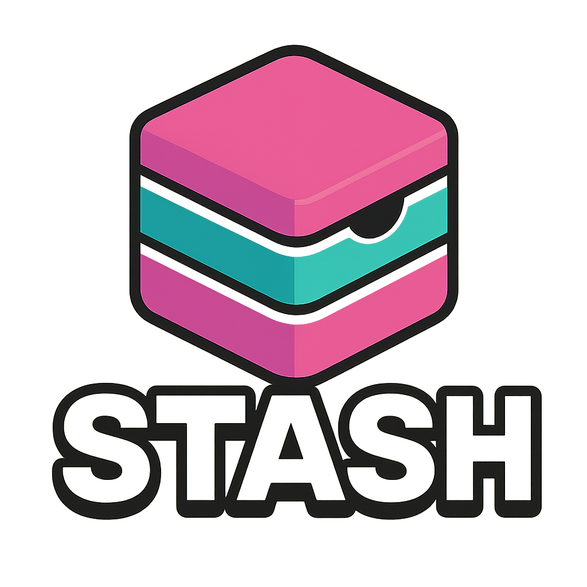

<p align="center">
  
</p>

<p align="center">
  
  
  <a href="#-dedication">
    
  </a>
</p>

Stash is a powerful file organization tool that helps you sort, archive, and manage your files efficiently.

## Features

- **Automatic Sorting**  
  Organizes files based on rules you define in a `rules.json` file. You can sort by file extension, MIME type, or interactively when a new type is encountered.

- **Interactive Rule Creation**  
  When a file with an unknown extension is found, Stash will prompt you to specify a folder. The rule is saved automatically for future use.

- **Ignore List Support**  
  Prevent specific file types from being sorted at all by adding them to an `"ignore"` list in your rules file.

- **Non-Recursive Operation**  
  Stash only sorts files in the top-level directory—subfolders are never entered or altered unless explicitly moved.

- **Capitalized Folder Targets**  
  By convention, folders like `Images`, `Videos`, or `Docs` are used as sorting targets, keeping your directory clean and readable.

- **Portable & Minimal Dependencies**  
  Runs as a standalone Python script without requiring a full framework or complex setup.

- **Optional macOS Folder Icon Assignment**  
  On macOS, you can assign custom icons to your `stash` folders to make them easier to identify visually.

- **Integration with DeepStash**  
  Easily move older or bulk files out of your main stash into a cold storage system using the DeepStash companion tool.

## 🧠 Origins

Stash began as a conceptual data structure — a digital “box” where users could throw anything with the intention of sorting it later. Inspired by the human habit of stashing files and folders into catch-all directories, this project set out to turn that chaos into structured automation.
What started as an abstract idea evolved into a real-world command-line tool that helps users organize their filesystem with minimal effort and maximum flexibility.

## Installation

### From PyPI (if available)

```bash
pip install stash
```

### From Source (Recommended for Development)

Clone the repository and install locally:

```bash
git clone https://github.com/trevortomesh/stash.git
cd stash
pip install .
```

Or install in editable mode for development:

```bash
pip install -e .
```

This allows you to make changes to the source code and use the updated `stash` command without reinstalling.

## Troubleshooting

If you encounter issues, try the following:

- Ensure Python 3.6+ is installed
- Check your PATH environment variable includes Python scripts
- Use `stash --help` to review command options
- Report bugs on GitHub Issues

## Usage

Basic usage example:

```bash
stash sort /path/to/your/files
```

For more commands and options, use:

```bash
stash --help
```

## Configuration

Stash uses a `rules.json` file inside each `.stash` directory to determine how files are sorted. Example:

```json
{
    "extensions": {
        "txt": "Docs",
        "ics": "Docs",
        "png": "Images",
        "ds": "Deep",
        "jpeg": "Images",
        "excalidraw": "Docs"
    },
    "mime_types": {}
}
```

## Tips

- Periodically check your sorted folders to ensure files are going to the expected locations.
- Combine with DeepStash for cold storage management.

## Uninstallation

To uninstall Stash:

```bash
pip uninstall stash
```

## Contributing

Contributions are welcome! Please fork the repository and submit a pull request.

## License

This project is licensed under the MIT License - see the LICENSE file for details.

## Support

For support, open an issue on GitHub or contact the maintainer.

## Related Projects

- **DeepStASH** – A sister project to Stash that provides advanced long-term archival and external drive backup for deeply cold files.  
  [https://github.com/trevortomesh/deep-stash](https://github.com/trevortomesh/deep-stash)

  ### 🧊 Suggested Use:
  You can find and install DeepStash here: https://github.com/trevortomesh/deep-stash

  DeepStash is designed to work alongside Stash — but it also stands strong on its own. Use it to offload files and folders to a long-term archive (such as an external drive) while keeping their original location and context intact via `.ds` metadata files.

  It safely stashes your items elsewhere, leaving behind smart placeholders you can use to restore them at any time. Perfect for cleaning up your workspace without breaking your mental map of where everything lives.

  To install:
  ```bash
  git clone https://github.com/trevortomesh/deep-stash.git
  cd deep-stash
  pip install .
  ```

  To use:

  1. Set the stash location:
     ```bash
     ds --init
     ```

  2. Stash an item:
     ```bash
     ds FinalPaper.pdf
     ```

  3. Restore an item:
     ```bash
     ds FinalPaper.pdf.ds
     ```

  4. View help and advanced options:
     ```bash
     ds --help
     ```

  DeepStash integrates beautifully with Stash to offload rarely used files after sorting — but it's equally effective on its own when you just need to move things without losing your structure.

---

## 🕊️ Dedication

This project is dedicated to the Lord.

All logic, structure, and order — including the very foundations of programming — reflect the perfection of His design. May this tool, in its small way, point toward the beauty and coherence He has written into the fabric of creation.

> **"I praise you, for I am fearfully and wonderfully made.  
> Wonderful are your works; my soul knows it very well."**  
> — Psalm 139:14

**Soli Deo Gloria.**